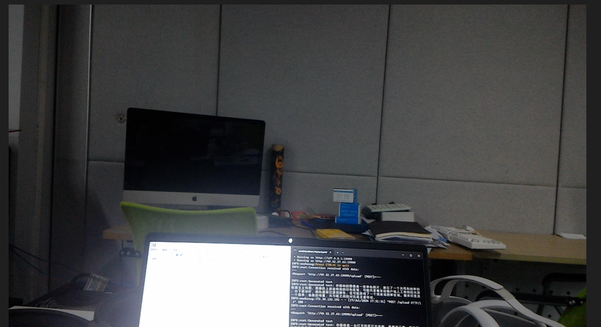
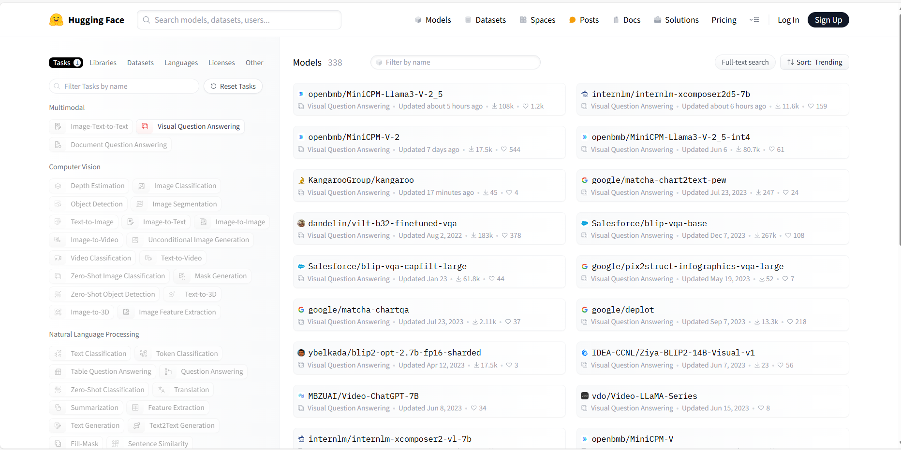

# Aeye技术文档

Aeye——面向视障人群的基于大语言模型的智能视觉辅助


## 1. 引言

#### **背景**：

Aeye 是一款专为视障人群设计的智能视觉辅助系统，旨在利用多模态大语言模型提供高效、准确、可沟通的视觉辅助功能。

#### **目标**：

通过微信小程序、Hololens、树莓派 作为前端，

结合 Spring Boot 后端服务，使用mysql和redis数据库

计算服务器使用miniCPM 提供视觉描述、物体识别等功能，使用神经网络提供人脸识别功能。

#### **范围**：
本技术文档侧重以上提到**技术的具体实现**


## 2. 系统架构

#### 2.1 总体架构

Aeye系统架构有前端应用（或IoT设备）、后端服务（包括数据存储）、计算服务器三部分


#### 2.2 模块划分

- **前端应用模块**：用户界面、图像采集、语音或文字输入输出
- **后端服务模块**：网络请求处理、数据管理（图像与历史对话）
- **计算服务模块**：自然语言处理、图像识别、人脸识别、文字识别


#### 2.3 数据流图


#### 2.4 系统接口

- **前端-后端接口**：通过后端提供的网络API进行数据传输
- **后端-计算接口**：使用redis数据库远程访问接口进行数据读写。


## 3. 前端

### 3.1 微信小程序

#### 3.1.1 技术栈

**开发工具**：微信开发者工具
**语言**：JavaScript, WXML, WXSS
**框架**：微信小程序原生JS框架


#### 3.1.2 页面设计

##### 首页

考虑到视障群体对于界面配色以及图标信息并不敏感，我们并没有在界面美化上投入太多时间。软件首页是一个介绍页（教程页），仅有一个button，点击即可进入。


##### 功能页

为了便于使用，四个功能页的布局类似。在此仅展示一个

最下方是一个tabbar，点击即可切换功能，也可以在屏幕上左右滑动来切换功能。

最上方的文字header表示当前功能，第一个textarea是AI回复的文本框，第二个textarea是用户输入的文本框。

点击按钮1可以选择图片并提交问题，点击按钮2则会跳转详细询问页。

由于我们的结果是由多模态大模型产生，因此可以充分理解用户的问题和提问，给出用户期望的答案。


##### 详细询问

此页面中，白底的文字或图片为用户发送的内容，而橙色底的文字为AI回复。

类似聊天界面，是可以上下滑动的。

最下方有一个输入框，此外可以附加图片发送或仅发送文字。


#### 3.1.3 功能与代码介绍

（详细的注释请查看代码）


##### 导航栏

index.page


点击图标或者文字附近的区域，可以直接跳转相应功能

此外，在整个页面上滑动也可以移动到附近页面

（例如：向左滑动且  轨迹角度<27°，则可以触发移动到右边的页面）

很靠下的文字不利于视障群体点击，所以我们设计了滑动的功能。

简单来说，滑动的原理是记录按下和抬起的坐标，进而计算移动向量。


##### 实景识别

对应fun1.page（被作为组件引用于index.page）


文字信息“在下方输入您的问题”是为了让talkback可以读出文字


处理 发送图片并询问  按钮事件的函数执行以下操作：

 * 1. 从应用的全局数据中获取全局登录码。
 * 2. 允许用户从设备中选择一个媒体文件（图片）。
 * 3. 压缩所选图片。
 * 4. 使用压缩图片的路径更新组件的数据。
 * 5. 获取并记录图片的信息（宽度和高度）。
 * 6. 向用户显示一个临时消息，指示处理过程。
 * 7. 将压缩图片和用户输入上传到服务器http://101.132.112.59:8123/AITalk，fun_id为1表示实景识别
 * 8. 处理服务器响应，使用AI响应或错误信息更新组件的数据。

接口为

```js
wx.uploadFile({
  url: 'http://101.132.112.59:8123/AITalk', 
  filePath: my_path,
  name: 'photo',

  formData: {
    loginCode: app.globalData.loginCode,
    newTalk: '1', // 
    kind: this.data.fun_id,
    question:user_input
  },
```


处理 详细询问  按钮事件的函数执行以下操作：

- 跳转详细询问页面
- 附加了一段历史对话，以及函数ID（表示当前的功能）

```js
wx.navigateTo({
    url: '/pages/detail/detail?pic_path='+this.data.pic_path+'&que='+this.data.send_to_detail+'&ai_res='+this.data.aiResponse+'&fun_id='+this.data.fun_id  // 指定目标页面路径
    });
```


##### 文字识别

对应fun2.page（被作为组件引用于index.page）


函数逻辑与实景识别一致，不过fun_id=2,表示文字识别功能


##### 人脸识别

对应fun3.page（被作为组件引用于index.page）


第一个textarea表示AI返回的结果，


第二个textarea表示用户当前已经上传的图片名称

获取这个信息是自动的，当您第一次进入此页面或者修改了人脸时，将自动从服务端获取信息。 get_all_name函数通过向服务器发送请求，获取用户已上传的所有人脸信息。 函数逻辑为 

1. 获取应用的全局数据（loginCode）。
2. 发送HTTP POST请求到后端接口/faceDetect，携带loginCode作为表单数据。
3. 处理服务器的响应，成功时将人脸信息显示在界面上，失败时显示错误信息。


第三个textarea表示用户修改的人脸名称（上传或删除时需要填写）


拍超询问按钮的代码大致与实景识别相同，只不过URL略微变化为http://101.132.112.59:8123/addPersonImg，因为后端逻辑不同。

类似的，上传图片为/addPersonImg,  删除为/deletePersonImg。


##### 自定义提示词

fun4.page（被作为组件引用于index.page）


如图，点击发送图片并询问时会检测提示词，一并发送。

必须填写提示词。不填写提示词会在AI回复区提示。

接口同样为/AITalk

直接传fun_id为提示词即可，格式类似fun1。


#####  详细对话


在此页面加载时，首先要接受来自父页面的参数：

```js
onLoad: function (options) {
    // 页面加载时的逻辑
  const { pic_path,que,ai_res ,fun_id, user_prompt_tmp} = options;
  this.setData({
    fun_id: fun_id
  });
    ......
```

然后写入历史信息。


可以上下滑动的聊天区域使用Scrool-view实现。

append_msg函数和set_last_msg函数，是我封装好的设置scrool-view中信息的接口。


这个页面中，用户发送图片的代码同样调用/AITalk 作为API接口，使用wx.upload上传图片和数据。类似fun1，但newtalk参数为0，代表继承上下文内容

仅发送文字时，为了以form-data格式上传，需要手动编码，类似：


### 3.2 Hololens（一代）

#### 开发环境：Unity 2017.4.40c1 + visual studio 2017

​	hololens视觉辅助以unity程序作为载体，调用hololens端硬件以实现与用户的交互以及与后端的交互，进而实现场景识别、读文字等功能。

#### 详细流程

##### 1. 语音识别用户命令

- 使用Hololens的语音识别功能，通过关键词识别触发不同的操作，如拍照和读文字。

##### 2. Hololens调用相机拍照

- 调用Hololens的相机功能拍照并保存图像到本地存储。
- 

##### 3. 发送内容至服务器并接收生成文本

- 将拍摄的图像上传到服务器，服务器处理图像并返回生成的文本。
- 

##### 4. 朗读文本

- 接收到服务器返回的文本后，使用语音合成功能朗读文本。


### 3.3 树莓派

#### overview

整体的实际是类似一个可以语音唤醒的语音助手。只要通过语音“小梅小梅”唤醒树莓派然后说出自己的问题或者指令即可。树莓派被唤醒后进入唤醒模式，进一步接受指令或者问题。指令包括“切换到情景（文字）识别”——用来切换应用，以及“没事”——直接退出唤醒模式 。其他的所有话都被视为问题。树莓派识别到用户的问题后会拍摄一张图片，然后把图片和问题传到后端进行识别，再把识别后的结果以语音的方式返回给用户。

#### 硬件支持

树莓派主机型号：Raspberry Pi 4B 8GB

摄像头：CreateBlock 500W像素摄像头

带麦克风的蓝牙耳机

#### 软件支持

树莓派操作系统：Linux raspberrypi 6.6.31+rpt-rpi-v8 #1 SMP PREEMPT Debian 1:6.6.31-1+rpt1 (2024-05-29) aarch64 GNU/Linux

python版本：3.11.2

#### 实现概述

系统通过蓝牙麦克风和蓝牙扬声器与用户交互，通过[百度智能云](https://cloud.baidu.com/)实现语音转文字（STT）以及文字转语音功能（TTS），与后端交互得到识别后的文字结果。


系统的整体逻辑如下图所示。


## 4. 后端

####  技术栈

使用springboot框架搭建后端


使用mybatisORM框架与mysql交互

使用redis作为缓存

部署在华为云（后改为阿里云）服务器

使用nginx提供外部网络访问服务

使用swagger-ui为前端提供接口说明文档

在测试接口过程中使用Postman进行测试

#### 软件支持

java 1.80

mybatis 2.11

mysql 8.0

redis 4.0.8


#### 访问流程


使用mybatisORM框架与mysql交互

使用redis作为缓存

部署在华为云（后改为阿里云）服务器

使用nginx提供外部网络访问服务

使用swagger-ui为前端提供接口说明文档

在测试接口过程中使用Postman进行测试

#### 软件支持

java 1.80

mybatis 2.11

mysql 8.0

redis 4.0.8


#### 访问流程


## 5. 计算服务器

### 5.1 大语言模型

​	本项目使用的是面向图文理解的多模态大模型**MiniCPM-Llama3-V 2.5**。

在hugging face的visual question answering模块内，MiniCPM-Llama3-V 2.5是近期发布的下载量最多的多模态大模型。




#### 模型介绍：

**MiniCPM-Llama3-V 2.5** 是 MiniCPM-V 系列的最新版本模型，基于 SigLip-400M 和 Llama3-8B-Instruct 构建，共 8B 参数量，相较于 MiniCPM-V 2.0 性能取得较大幅度提升。MiniCPM-Llama3-V 2.5 值得关注的特点包括：

- 🔥 **领先的性能。** MiniCPM-Llama3-V 2.5 在综合了 11 个主流多模态大模型评测基准的 OpenCompass 榜单上平均得分 65.1，**以 8B 量级的大小超过了 GPT-4V-1106、Gemini Pro、Claude 3、Qwen-VL-Max 等主流商用闭源多模态大模型**，大幅超越基于Llama 3构建的其他多模态大模型。
- 💪 **优秀的 OCR 能力。** MiniCPM-Llama3-V 2.5 可接受 180 万像素的任意宽高比图像输入，**OCRBench 得分达到 725，超越 GPT-4o、GPT-4V、Gemini Pro、Qwen-VL-Max 等商用闭源模型**，达到最佳水平。基于近期用户反馈建议，MiniCPM-Llama3-V 2.5 增强了全文 OCR 信息提取、表格图像转 markdown 等高频实用能力，并且进一步加强了指令跟随、复杂推理能力，带来更好的多模态交互体感。
- 🏆 **可信行为。** 借助最新的 [RLAIF-V](https://github.com/RLHF-V/RLAIF-V/) 对齐技术（[RLHF-V](https://github.com/RLHF-V/) [CVPR'24]系列的最新技术），MiniCPM-Llama3-V 2.5 具有更加可信的多模态行为，在 Object HalBench 的幻觉率降低到了 **10.3%**，显著低于 GPT-4V-1106 (13.6%)，达到开源社区最佳水平。


#### 前期调研：

##### 	不同的模型：

|                    | Meta-Llama-3-8B                                              | MiniCPM-Llama3-V-2_5                   | microsoft/Florence-2-large                                   |
| ------------------ | ------------------------------------------------------------ | -------------------------------------- | ------------------------------------------------------------ |
| 参数               | 8B                                                           | 8B                                     | 0.77B                                                        |
| 类型               | 大语言模型                                                   | 多模态大模型                           | 图生文                                                       |
| 部署难度（兼容性） | ⭐⭐                                                           | ⭐⭐⭐⭐                                   | ⭐⭐⭐                                                          |
| 发布时间           | 2024.04.18                                                   | 2024.05.20                             | 2024.06                                                      |
| 多对话能力         | ⭐⭐⭐⭐⭐                                                        | ⭐⭐⭐⭐                                   | 无                                                           |
| OCR能力            | 无                                                           | ⭐⭐⭐⭐⭐                                  | ⭐⭐⭐⭐                                                         |
| 备注               | 原计划对大语言模型进行微调以支持图像理解能力，但是硬件成本和时间成本比较高，于是被放弃 | 可以在端侧应用，可以部署在高性能手机端 | 作为一个轻量级应用，在部分场景具有优势，但是本项目需要足够的对话能力 |


#### 部署实现：

​	在wangye老师提供的服务器上进行部署。配置为3090*2。

​	推理API接口：Huggingface Transformers库，这是一个流行的自然语言处理库，支持多种预训练的Transformer模型（如BERT、GPT、T5等）。提供简单的API用于加载和使用这些模型进行推理、微调等任务。

​	实测Pytorch<2.0也是可以的。

```python
# test.py
import torch
from PIL import Image
from transformers import AutoModel, AutoTokenizer

model = AutoModel.from_pretrained('openbmb/MiniCPM-Llama3-V-2_5', trust_remote_code=True, torch_dtype=torch.float16)
model = model.to(device='cuda')

tokenizer = AutoTokenizer.from_pretrained('openbmb/MiniCPM-Llama3-V-2_5', trust_remote_code=True)
model.eval()

image = Image.open('xx.jpg').convert('RGB')
question = 'What is in the image?'
msgs = [{'role': 'user', 'content': question}]

res = model.chat(
    image=image,
    msgs=msgs,
    tokenizer=tokenizer,
    sampling=True, # if sampling=False, beam_search will be used by default
    temperature=0.7,
    # system_prompt='' # pass system_prompt if needed
)
print(res)
```


### 5.2 人脸识别模型

经过调研，目前较为成熟的人脸识别方式均为检测人脸+特征向量计算

其中**目标检测**可以使用基于two-stage的yolo系列人脸检测网络，

也可以使用基于one-stage的人脸检测网络，例如Retinaface，具有较好的表现。

**特征向量计算**可以使用arcface或者谷歌人脸识别算法facenet


我们在目标检测使用了Retinaface，向量计算采用了facenet，因为效果较好，且我们较为熟悉。

Retinaface


facenet


代码有参考这个项目[bubbliiiing/facenet-retinaface-pytorch: 这是一个利用facenet和retinaface实现人脸识别的库，可以进行在线的人脸识别。 (github.com)](https://github.com/bubbliiiing/facenet-retinaface-pytorch)

Retinaface的主干网络我们选用了resnet50，facenet我们使用了mobilenet。

目录结构：


face_dataset中存放了每个用户的数据集，包括已经上传的图片和编码文件（.npy）


我们同时运行了两份Retinaface+facenet，

其一用来接收用户修改的图片信息，并重新编码数据（即扫描图片文件，识别人脸后计算特征向量，存储。）

其一用来接收用户识别请求。首先加载用户编码好的特征向量和名称，再识别图片中的人脸并逐一与数据库比对。

详细的代码可以参考talk.py,其中有我封装好的函数，可以直接调用。

例如

```python
# 测试user_id数据集下的url
# return 一个list，包含照片里的人脸的名字
def teste(user_id,url):
    try:
        # 加载用户数据
        retinaface_tester.known_face_encodings = np.load("./fr_main/face_dataset/"+user_id+"/npy/face_encoding.npy")
        retinaface_tester.known_face_names     = np.load("./fr_main/face_dataset/"+user_id+"/npy/face_names.npy")
        
        # 读取URL的图片
        response = requests.get(url)
        response.raise_for_status()
        image = Image.open(BytesIO(response.content)).convert('RGB')
        image = np.array(image)
        
        # 调用模型方法识别，获得返回值
        ret = retinaface_tester.detect_image(image)
        r_image,face_names=ret[0],ret[1]
        return face_names
        # r_image = cv2.cvtColor(r_imPage,cv2.COLOR_RGB2BGR)
        # cv2.imshow("after",r_image)
        # cv2.waitKey(0)
    except:
        #print("err!")
        return ['error']
```


### 5.3 redis数据访问

使用轮询+消息队列机制实现内网计算服务器与外网后端服务器间的通信。


例如，读取fun_id为1, 则替换模型引导词为

```
你是一位乐于助人的视觉识别专家,盲人用户会拍摄照片并向你询问照片中的内容.
你的任务是简要准确地描述照片中的内容.
一定要分条描述,例如1.2.3.4.
```

读取fun_id为2, 则替换模型引导词为


```
你的任务是准确描述照片中的所有文字
```

也支持自定义引导词，可输入模型。


