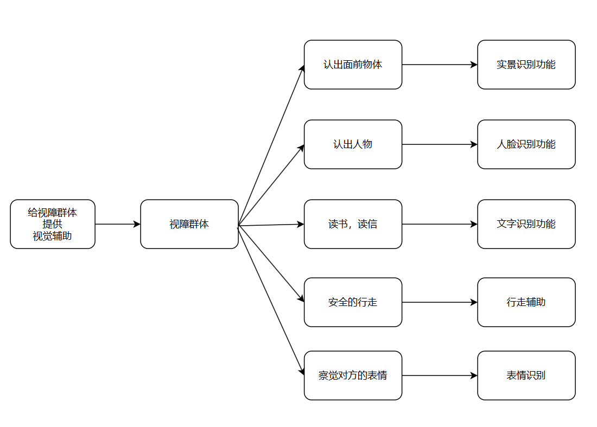
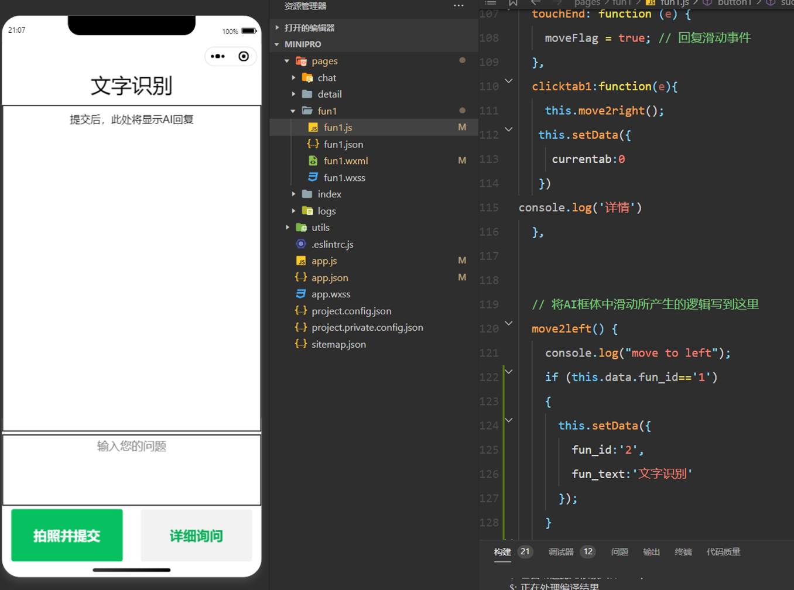

# 敏捷开发纪要

## 功能畅想

① 实景识别（ yolo+大模型 ，可提问交互）

② 人脸识别（yolo+arcface+大模型）

​	 文字识别 

④ 行走辅助（yolo   以及更多cv算法，实时的）

​	 表情识别

​     颜色识别（大模型可做？）

​	志愿者人工

##### others

③ 语音交互

⑥ （上下文无关）多段对话or 清空历史对话？

## 影响地图

## 用户旅程

用户：视障群体 

目标：愉快的一天

| 旅程 | 穿搭           | 关门               | 去坐公交                   | 交接工作             | 聊天         |
| ---- | -------------- | ------------------ | -------------------------- | -------------------- | ------------ |
| 行动 | 寻找一个帽子   | 摸到门口有张纸     | 走到公交站                 | 找到协作的同事       | 我讲了个笑话 |
| 想法 | 忘记了，在哪？ | 写的什么？         | 路上会不会有危险           | 他在哪，这个人是他吗 | 他笑了吗     |
| 感受 | 又要找好久     | 广告还是通知单     | 害怕危险                   | 万一找错人了，好尴尬 | 忐忑不安     |
| 机会 | 实景识别辅助   | 文字识别，语音读出 | 实时行走辅助，识别危险信息 | 人脸识别辅助         | 表情识别     |

## 简单故事

1.  我想买到雪碧，

    我拿起了一瓶饮料，但不知道是否是雪碧

    使用实景识别功能

2.  我想看信

    我看不见

    使用文字识别功能

## 用户故事 User Story

作为一个盲人，我想快速知道我面前是什么东西，以便做出下一步行为

满意条件：实现实景识别功能 

作为一个盲人，我需要阅读一些文字信息，以便

满意条件：实现OCR功能

作为一个盲人， 我想要辨别面前的人，

满意条件：人脸识别功能

## 细分子功能，规划任务

| 子功能                                      | 技术                                                         | 任务量 | 排序 |
| ------------------------------------------- | ------------------------------------------------------------ | ------ | ---- |
| ✅实景识别）                                 | 部署计算服务器上的大语言模型（图+文->文                      | 40     | 1    |
| ✅搭建小程序框架，对接后端，接口设计，ui设计 | （需要学习）小程序界面设计，设计接口                         | 80     | 1    |
| ✅搭建服务器                                 | 是否需要再次转接校园网计算服务器？                           | 5      | 1    |
| ✅接入更多IoT设备                            | 硬件+新接口                                                  | 80     | 2    |
| ✅文字识别                                   | OCR传统算法 + 大语言模型                                     | 8      | 2    |
| ✅多图、多对话、数据库实现上下文             |                                                              | 13     | 2    |
| ✅人脸识别                                   | 部署计算服务器上的人脸识别模型+用户数据集存储（后端）        | 40     | 3    |
| ✅整体测试                                   |                                                              | 8      | 4    |
| ✅小程序教程                                 | 录制音频                                                     | 3      | 4    |
| ✅自定义提示词识别                           |                                                              | 8      | 4    |
| 最终PPT、需求、测试文档                     |                                                              |        | 4    |
|                                             |                                                              |        |      |
|                                             |                                                              |        |      |
| 表情识别                                    | （时间原因暂未实现）                                         | 20     |      |
| ❌行走辅助                                   | 暂定为连续的实景识别，进阶可以使用其他cv算法（AI推理较慢，效果不佳） | ？     |      |
| ❌小程序语音交互                             | 调用语音识别API或者本地识别（不需要）                        | 13     | 2    |
| ❌yolo辅助实景识别                           | 部署计算服务器上的yolo模型，作为语言输入（不需要）           | 13     | 3    |
| ❌APP 实景导航、室内导航（？）               | 百度api（SDK调用，难）                                       | 80     | 3？  |
|                                             |                                                              |        |      |
|                                             |                                                              |        |      |
|                                             |                                                              |        |      |

# 第一次Sprint

 

### Planning

第一次迭代任务：

| 子功能                                     | 技术                                    | 任务量 | 排序 |
| ------------------------------------------ | --------------------------------------- | ------ | ---- |
| ✅实景识别）                                | 部署计算服务器上的大语言模型（图+文->文 | 20     | 1    |
| 搭建小程序框架，对接后端，接口设计，ui设计 | （需要学习）小程序界面设计，设计接口    | 80     | 1    |
| ✅搭建服务器                                | 是否需要再次转接校园网计算服务器？      | 5      | 1    |

daily scrum：时间：  课间

### 第一次spring review

##### **前端微信小程序**

在进行了前端ui设计后，我们完成了多个界面的前端代码。包括文字识别，实景识别，人脸识别，详细说明。

为了方便盲人操作，我们为小程序加上了左滑右滑的操作，使得页面切换更为快捷。

##### **后端**

后端使用springboot框架，数据库方面使用mysql+mybatisORM框架

前后端对接使用Postman进行接口测试，使用swagger-ui文档为前端提供接口介绍

后端部署在华为云服务器上，连接校内vpn后使用花生壳进行内网穿透，从而实现与外网和校内计算服务器的双端连接

##### **ai**

计算服务部署在课程提供的服务器上，使用flask框架，实现了远程api接口访问多模态大模型

### spring Retrospective

##### **合作开发**

我们在github上对我们的代码进行了版本控制，成员们能并行地开发不同的功能，互不干扰。可以方便地跟踪工作进度，分配任务，并进行讨论和决策。在之后的工作中会继续使用这种高效的方式。

在第一次迭代过程中，我们的会议时长超过了我们的预期。在接下来的迭代中，我们会尝试提高会议效率，在会前明确开会内容，拒绝边写代码边开会

# 第二次Sprint

#### Sprint planning

| 子功能                                             | 技术                                                  | 任务量 | 排序 |
| -------------------------------------------------- | ----------------------------------------------------- | ------ | ---- |
| 接入更多IoT设备                                    | 硬件+新接口                                           | 100+   | 2    |
| 优化： 小程序框架，对接后端，接口设计，ui设计 | （需要学习）小程序界面设计，设计接口                  | 80     | 2    |
| ✅数据库实现上下文                                  |                                                       | 13     | 2    |
| 人脸识别（先调研？）                               | 部署计算服务器上的人脸识别模型+用户数据集存储（后端） | 40     | 3    |

杂项：

前端引导词

redis缓存：logincode->openid

ai端轮询数据库或消息队列

### spring review

#### 前端

小程序：UI及交互逻辑优化 、压缩图片、多对话

loT： 拍照app、图片同步到AI端、结果生成

#### 后端：

内网穿透 -> 轮询 

redis 数据库：存   登录信息、多对话历史

#### AI端：

轮询设计

提示词优化、上下文长度、多图实现、多轮对话实现

### spring Retrospective

周报制度：自我监督

会：很快的开

# 第三次Sprint

### Sprint planning

| 子功能                                             | 技术                                                  | 任务量 | 排序 |
| -------------------------------------------------- | ----------------------------------------------------- | ------ | ---- |
| 优化： 小程序框架，对接后端，接口设计，ui设计 | （需要学习）小程序界面设计，设计接口                  | 80     | 1-3  |
| ✅人脸识别                                          | 部署计算服务器上的人脸识别模型+用户数据集存储（后端） | 40     | 3    |
| 实景导航、室内导航（？）                           | 百度api                                               | 80     | 3？  |
| 接入更多IoT设备                                    | 硬件+新接口                                           | 100+   | 2-3  |

### spring review

#### 前端

小程序：UI底部导航栏， 人脸识别界面实现

loT： 优化连接，实现语言读文字

#### 后端：

mysql 人脸识别数据存储

实现人脸识别相关接口

服务器迁移

#### AI端：

实现人脸识别功能，图片存储

实现人脸识别接口

### spring Retrospective

服务器注意安全

勇于尝试可能性 敏捷开发

# 第四次Sprint

### Sprint planning

| 子功能                                      | 技术                                 | 任务量 | 排序 |
| ------------------------------------------- | ------------------------------------ | ------ | ---- |
| ✅接入更多IoT设备                            | 硬件+新接口                          | 80     | 2-4  |
| ✅搭建小程序框架，对接后端，接口设计，ui设计 | （需要学习）小程序界面设计，设计接口 | 80     | 1-4  |
| APP 实景导航、室内导航（？）                | 百度api                              | 80     | ？   |
| ✅整体测试、测试文档                         |                                      | 20     | 4    |
| ✅小程序教程                                 | 录制音频                             | 3      | 4    |
| ✅**最终PPT、需求文档、**                    |                                      | 40     | 4    |
| 表情识别                                    |                                      | 40     | ？   |

### spring review

#### 前端

小程序：引导界面、教程、UI优化、图片设计、自定义提示词、逻辑优化

loT： 接入树莓派

#### 后端：

自定义提示词接口完成

#### AI端：

实现自定义提示词接口

#### 测试

完成了所有测试工作

#### 文档

完善项目项目相关文档

# 总结

7月6日，我们的Product Backlog

| 子功能                                     | 技术                                                  | 任务量 | 排序(第几次迭代实现) |
| ------------------------------------------ | ----------------------------------------------------- | ------ | -------------------- |
| 实景识别）                                 | 部署计算服务器上的大语言模型（图+文->文               | 20     | 1                    |
| 搭建小程序框架，对接后端，接口设计，ui设计 | （需要学习）小程序界面设计，设计接口                  | 80     | 1                    |
| 搭建服务器                                 | 是否需要再次转接校园网计算服务器？                    | 5      | 1                    |
| yolo辅助实景识别                           | 部署计算服务器上的yolo模型，作为语言输入              | 13     | 2                    |
| 小程序语音交互                             | 调用语音识别API或者本地识别                           | 13     | 2                    |
| 文字识别                                   | OCR传统算法 + 大语言模型                              | 20     | 3                    |
| 小程序语音教程                             | 录制音频                                              | 1      | 3                    |
| 人脸识别                                   | 部署计算服务器上的人脸识别模型+用户数据集存储（后端） | 40     | 3                    |
| 整体测试                                   |                                                       | 8      | 4                    |
|                                            |                                                       |        |                      |
| 表情识别                                   |                                                       | ？     |                      |
| 行走辅助                                   | 暂定为连续的实景识别，进阶可以使用其他cv算法          | ？     |                      |

7月23日，我们的Product Backlog

| 子功能                                      | 技术                                                         | 任务量 | 排序 |
| ------------------------------------------- | ------------------------------------------------------------ | ------ | ---- |
| ✅实景识别）                                 | 部署计算服务器上的大语言模型（图+文->文                      | 40     | 1    |
| ✅搭建小程序框架，对接后端，接口设计，ui设计 | （需要学习）小程序界面设计，设计接口                         | 80     | 1    |
| ✅搭建服务器                                 | 是否需要再次转接校园网计算服务器？                           | 5      | 1    |
| ✅接入更多IoT设备                            | 硬件+新接口                                                  | 80     | 2    |
| ✅文字识别                                   | OCR传统算法 + 大语言模型                                     | 8      | 2    |
| ✅多图、多对话、数据库实现上下文             |                                                              | 13     | 2    |
| ✅人脸识别                                   | 部署计算服务器上的人脸识别模型+用户数据集存储（后端）        | 40     | 3    |
| ✅自定义提示词识别                           |                                                              | 8      | 4    |
| ✅整体测试                                   |                                                              | 8      | 4    |
| ✅小程序教程                                 | 录制音频                                                     | 3      | 4    |
| 最终PPT、需求、测试文档                     |                                                              |        | 4    |
|                                             |                                                              |        |      |
| 表情识别                                    | （时间原因暂未实现）                                         | 20     |      |
| ❌行走辅助                                   | 暂定为连续的实景识别，进阶可以使用其他cv算法（AI推理较慢，效果不佳） | ？     |      |
| ❌小程序语音交互                             | 调用语音识别API或者本地识别（不需要）                        | 13     | 2    |
| ❌yolo辅助实景识别                           | 部署计算服务器上的yolo模型，作为语言输入（不需要）           | 13     | 3    |
| ❌APP 实景导航、室内导航（？）               | 百度api（SDK调用，难）                                       | 80+    | 3？  |
|                                             |                                                              |        |      |
|                                             |                                                              |        |      |
