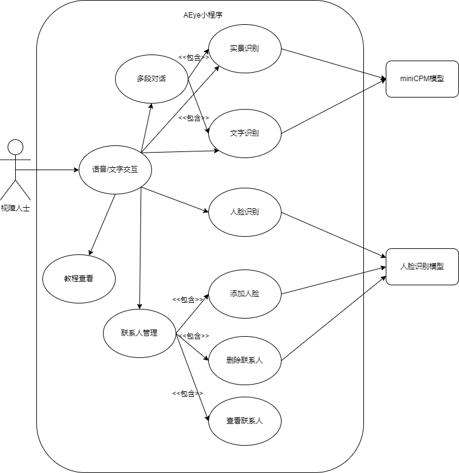
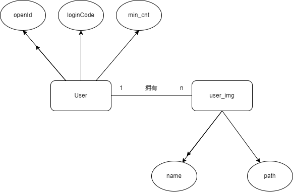
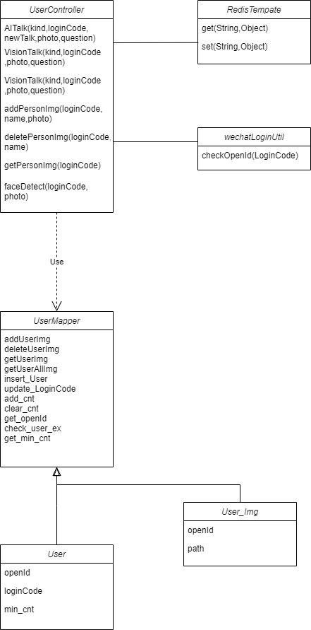

# AEYE需求文档

### 目录

1.引言

1.1 编写目标

1.2 读者对象

1.3 文档概述

1.4 术语定义

1.5 参考文献

2.软件系统概述

2.1 软件产品概述

2.2 用户特征

2.3 设计和实现约束

2.4 假设与依赖

3.功能性需求描述

3.1 软件功能概述

3.2 软件需求的用例模型

3.3 软件需求的分析模型

4.非功能性需求

5.界面需求

6.接口定义

7.进度要求

8.交付要求

9.何种形式来交付

10.验收要求

## 1.引言

### 1.1编写目标

​	本文档旨在明确视障辅助小程序的设计和功能需求，以确保所有参与项目开发的团队成员对软件的目标有共同的理解。该文档将涵盖用户特征、软件系统功能、界面需求等多个方面。通过此文档，我们将定义软件的功能及实现方式，指导开发工作，并为后续的测试和维护提供基础。

### 1.2 读者对象

本需求文档的主要读者包括但不限于：

**项目开发团队**：第三小组全部成员

**最终用户**：视障人士及其监护人（如家庭成员、医生）。

**第三方评估人员**：老师或助教。

**利益相关者**：投资商（若未来进行商业化）

### 1.3 文档概述

 本文档分为多个章节，详细描述了视障辅助小程序AEye的各类需求。接下来的部分包括：引言，软件系统概述，功能性需求描述，非功能性需求，界面需求，接口定义，进度要求，交付要求，何种形式来交付，验收要求。

### 1.4 术语定义

为了确保文档的一致性和避免混淆，我们将列出一些在本文档中使用的术语的定义：

**AEye**：本软件的项目名称，作为一款专为视觉障碍用户设计的移动应用小程序，旨在提供实景识别、文字识别和其他日常生活辅助功能。

**无障碍设计**：指软件设计时考虑到所有用户，包括那些有身体或认知障碍的人，确保他们能够无障碍地使用软件。

**随选朗读**：将手机中用户所选文本转换为语音输出的技术，是当前主流手机厂商在无障碍模式下均会设有的功能。

## 2.软件系统概述

### 2.1 软件产品概述

本小程序是一款专为视障人士设计的辅助应用，旨在利用现代智能设备的传感器和网络连接能力，为用户提供环境感知、导航指引、文字识别和语音交互等功能。通过集成先进的机器学习算法和语音合成技术，该应用能够实时分析周围环境，提供清晰的音频反馈，帮助用户更独立、更自信地在各种场景下行动。

### 2.2 用户特征

目标用户群主要是视觉障碍人士，年龄分布广泛，从青少年到老年人不等。他们可能具有不同程度的视力丧失，从轻微的视觉模糊到完全失明。用户可能具备不同的技术水平，从初学者到熟练用户都有，因此，软件需要具备直观的用户界面和易学的交互模式。考虑到用户可能伴随有其他健康问题，如听力减退，应用应提供可调节的音量和语速选项。

### 2.3 设计和实现约束

**性能要求**：应用必须在限定的时间内反馈给用户结果，即使任意服务模块出现问题。

**隐私保护**：软件需遵守相关的隐私法规，确保用户的个人信息和数据安全。

**无障碍标准**：软件的设计和功能必须符合WCAG（Web Content Accessibility Guidelines）和ISO 9241系列标准，确保大部分用户能够无障碍使用。

### 2.4 假设与依赖

**假设**：

用户拥有至少一部带有摄像头，拥有无障碍模式和互联网连接功能的智能手机。

用户熟悉基本的触摸屏操作。

**依赖**：

微信小程序平台，用于提供小程序界面以及交互功能。

云服务用于持久化存储存储用户个人信息和部分对话上下文数据。

开源的机器学习模型和自然语言处理引擎，用于提供AI辅助识别服务。

## 3. 功能性需求描述

### 3.1 软件功能概述

我们的微信小程序旨在为视障用户提供一个直观且强大的工具，用于识别并理解周围环境。主要功能包括：

**实景识别**：能够分析图像中的场景，描述环境特征。

**文字识别**：能够读取并转换图像中的文字到语音或文本，帮助用户阅读路标、菜单、公告等。

**人脸识别**：识别已知联系人或名人，帮助用户在社交场合中辨认他人。

**语音/文字问答**：用户可以使用语音或文字提问关于图像的内容，系统将返回相应的解释或信息。

**多段对话功能**：允许用户就一张图片提出多个问题，以获取更深入的信息。

### 3.2 软件需求的用例模型

### 3.3 软件需求的分析模型

数据库E-R图设计：

UML图设计：

## 4. 非功能性需求

### 4.1 性能需求

**响应时间**：系统应在5秒内处理完图像并返回初步识别结果。

**并发处理**：小程序应能同时处理来自多个用户的请求，而不降低响应速度。

**资源消耗**：在手机上运行时，应用应尽量减少电池消耗和内存占用。

### 4.2 可靠性需求

**准确率**：识别的准确率应至少达到90%以上，尤其是在文字和人脸识别方面。

**容错能力**：即使出现AI服务端断联等情况也应当在可接收时间内返回结果。

### 4.3 安全性需求

**隐私保护**：确保用户数据的安全，对敏感信息如用户上传图片进行加密存储。

**权限管理**：仅在用户明确授权的情况下访问相机和存储设备。

### 4.4 可用性需求

**易用性**：界面与功能设计应简洁明了，便于快速上手。

**无障碍设计**：考虑到目标用户群，确保所有功能都可以通过语音命令操作，且尽量少使用图标而多使用文字引导。

## 5. 界面需求

### 5.1 语音交互设计

**清晰文字说明**：对于小程序端，功能提示、使用说明均应有清晰的文字以便进行语音提示。

**语音命令识别**：对于IOT设备端，支持多种常用命令，如“拍照”、“识别文字”、“描述场景”等，并具备一定的语义理解能力。

### 5.2 触摸导航设计

**手势控制**：提供简单的手势操作，如滑动切换功能、双击确认等。

### 5.3 视觉辅助设计

**高对比度界面**：使用高对比度的颜色方案，便于低视力用户识别。

**大字体显示**：尽可能使用较大字体以便各类手机厂商的无障碍系统进行较为便捷的读文字。

### 5.4 用户引导

**使用向导**：提供详细的文字语音引导，帮助新用户快速熟悉小程序的操作流程。

## 6.接口定义

### 6.1 AITalk

#### 功能

小程序进行实景识别，文字识别或自定义prompt的询问

#### 参数

| Name      | Description                                                 |
| :-------- | :---------------------------------------------------------- |
| kind      | 调用AI服务类型，1为实景识别，2为文字识别,其余为自定义prompt |
| loginCode | 登录码                                                      |
| newTalk   | 是否为新对话（bool）                                        |
| photo     | 照片                                                        |
| question  | 用户的提问                                                  |

#### 返回值

一个字符串 代表AI端回复/报错信息

### 6.2 VisionTalk

#### 功能

IOT设备进行实景识别，文字识别

#### 参数

| Name     | Description                              |
| :------- | :--------------------------------------- |
| kind     | 调用AI服务类型，1为实景识别，2为文字识别 |
| photo    | 照片                                     |
| question | 用户的提问                               |

#### 返回值

一个字符串 代表AI端回复/报错信息

### 6.3 addPersonImg

#### 功能

增加联系人人脸

#### 参数

| Name      | Description |
| :-------- | :---------- |
| loginCode | 登录码      |
| photo     | 照片        |
| name      | 联系人姓名  |

#### 返回值

一个字符串 代表执行结果

### 6.4 deletePersonImg

#### 功能

删除联系人

#### 参数

| Name      | Description |
| :-------- | :---------- |
| loginCode | 登录码      |
| name      | 联系人姓名  |

#### 返回值

一个字符串 代表执行结果

### 6.5 getPersonImg

#### 功能

获取用户已有的联系人列表

#### 参数

| Name      | Description |
| :-------- | :---------- |
| loginCode | 登录码      |

#### 返回值

一个字符串列表 代表所有现有联系人

### 6.6 faceDetect

#### 功能

人脸识别

#### 参数

| Name      | Description |
| :-------- | :---------- |
| loginCode | 登录码      |
| photo     | 照片        |

#### 返回值

返回一系列检测到的熟人名称或陌生人（某个人脸不被AI认为是熟人）

## 7. 进度要求

### 第一次迭代任务要求

ui设计，搭建小程序框架

ai端大模型部署

后端服务器部署，与小程序前端与ai端双端对接

实现基本的实景识别功能

### 第二次迭代任务要求

调研IOT设备

实现文字识别

实现多段对话功能，支持实景识别和文字识别

### 第三次迭代任务要求

IOT设备实现实景识别，文字识别功能

实现人脸识别功能

### 第四次迭代任务要求

优化软件整体功能，提升用户体验

实现优先级低的功能（如实景导航，表情识别）

## 8.交付要求

**完整代码库**：所有源代码，包括前端、后端、数据库架构和API接口。

**相关文档**：需求文档，技术文档，设计文档，测试文档等。

**软件包**：编译后的安装包或部署包，适合在目标平台上运行。

**数据库脚本**：用于初始化数据库的SQL脚本。

**配置文件**：包括服务器与数据库配置、环境变量等。

## 9.何种形式来交付

在github上开源前后端源代码，并发布文档等内容。

在课堂上进行报告，并进行实机演示。

## 10.验收要求

**功能测试**：所有列出的功能需求须按预期工作，无严重缺陷。

**性能测试**：软件须达到非功能性需求中规定的性能指标。

**兼容性测试**：在指定的设备和操作系统上运行正常。

**安全性测试**：软件应通过安全审计，确保用户数据安全。

**合规性检查**：确认软件遵循所有相关的法规和行业标准。

**文档审核**：所有文档应齐全，信息准确，易于理解。
