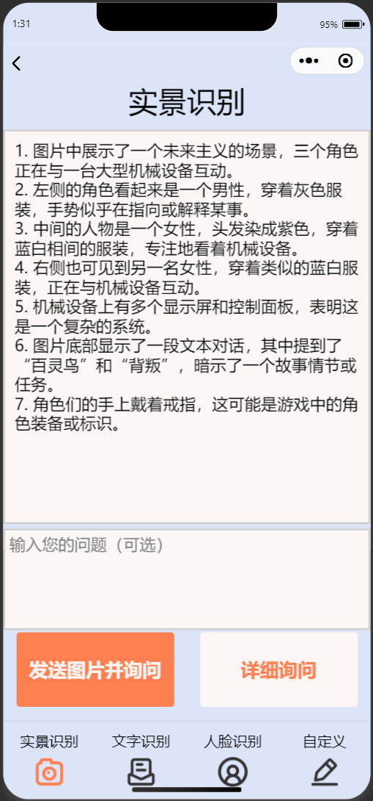

# Aeye技术文档

Aeye——面向视障人群的基于大语言模型的智能视觉辅助

## 1. 引言

#### **背景**：

Aeye 是一款专为视障人群设计的智能视觉辅助系统，旨在利用多模态大语言模型提供高效、准确、可沟通的视觉辅助功能。

#### **目标**：

通过微信小程序、Hololens、树莓派 作为前端，

结合 Spring Boot 后端服务，使用mysql和redis数据库

计算服务器使用miniCPM 提供视觉描述、物体识别等功能，使用神经网络提供人脸识别功能。

#### **范围**：
本技术文档侧重以上提到**技术的具体实现**

## 2. 系统架构

#### 2.1 总体架构

Aeye系统架构有前端应用（或IoT设备）、后端服务（包括数据存储）、计算服务器三部分

#### 2.2 模块划分

- **前端应用模块**：用户界面、图像采集、语音或文字输入输出
- **后端服务模块**：网络请求处理、数据管理（图像与历史对话）
- **计算服务模块**：自然语言处理、图像识别、人脸识别、文字识别

#### 2.3 数据流图

#### 2.4 系统接口

- **前端-后端接口**：通过后端提供的网络API进行数据传输
- **后端-计算接口**：使用redis数据库远程访问接口进行数据读写。

## 3. 前端

### 3.1 微信小程序

#### 3.1.1 技术栈

**开发工具**：微信开发者工具
**语言**：JavaScript, WXML, WXSS
**框架**：微信小程序原生JS框架

#### 3.1.1 页面设计

考虑到视障群体对于界面配色以及图标信息并不敏感，我们并没有在界面美化上投入太多时间。

### 3.2 Hololens

### 3.3 树莓派

#### overview

整体的实际是类似一个可以语音唤醒的语音助手。只要通过语音“小梅小梅”唤醒树莓派然后说出自己的问题或者指令即可。树莓派被唤醒后进入唤醒模式，进一步接受指令或者问题。指令包括“切换到情景（文字）识别”——用来切换应用，以及“没事”——直接退出唤醒模式 。其他的所有话都被视为问题。树莓派识别到用户的问题后会拍摄一张图片，然后把图片和问题传到后端进行识别，再把识别后的结果以语音的方式返回给用户。

#### 硬件支持

树莓派主机型号：Raspberry Pi 4B 8GB

摄像头：CreateBlock 500W像素摄像头

带麦克风的蓝牙耳机

#### 软件支持

树莓派操作系统：Linux raspberrypi 6.6.31+rpt-rpi-v8 #1 SMP PREEMPT Debian 1:6.6.31-1+rpt1 (2024-05-29) aarch64 GNU/Linux

python版本：3.11.2

#### 实现概述

系统通过蓝牙麦克风和蓝牙扬声器与用户交互，通过[百度智能云](https://cloud.baidu.com/)实现语音转文字（STT）以及文字转语音功能（TTS），与后端交互得到识别后的文字结果。

系统的整体逻辑如下图所示。

## 4. 后端

## 5. 计算服务器

### 5.1 大语言模型

### 5.2 人脸识别模型

### 5.3 redis数据访问

