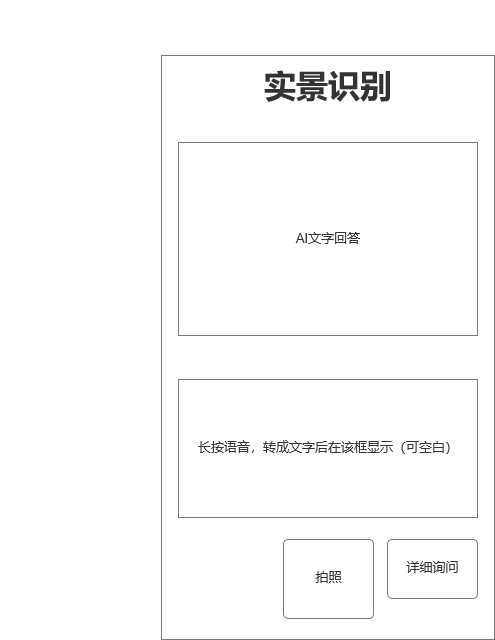
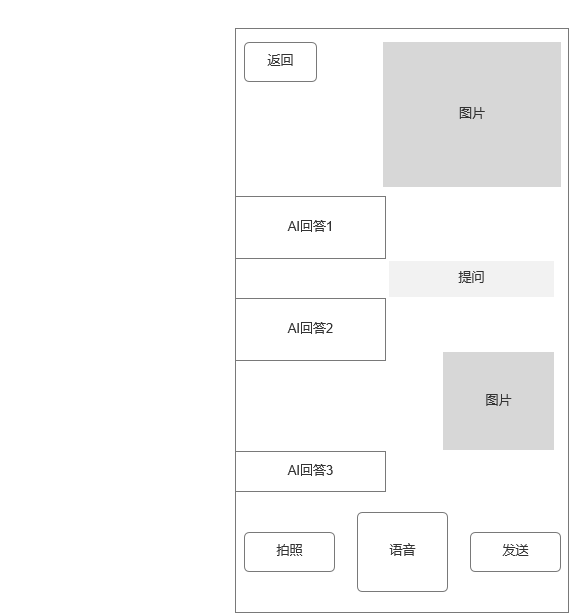
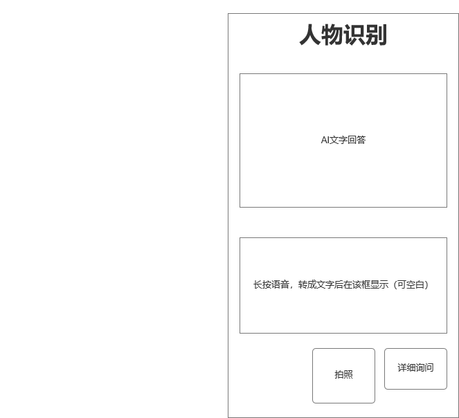

# Aeye软件设计文档

Aeye——面向视障人群的基于大语言模型的智能视觉辅助

## 1. 引言

#### 1.1 项目背景

视障人群在日常生活中面临许多挑战，特别是在独立行动和信息获取方面。Aeye项目旨在结合大语言模型和先进的计算机视觉技术，为视障人群提供一种智能的视觉辅助工具。

#### 1.2 文档目的

本文档的目的是描述Aeye系统的设计方案，包括系统架构、模块划分、数据设计和用户界面设计，指导开发团队进行实现和后续维护。在关于技术的更多设计和考量上，请参照技术文档。

#### 1.3 范围

本文档涵盖Aeye系统的主要设计，包括功能模块、数据库设计、接口设计和用户界面设计

## 2. 系统概述

#### 2.1 系统描述

Aeye是一款基于大语言模型和计算机视觉技术的智能视觉辅助工具，旨在为视障人群提供实时的环境描述、物体识别、文字读取、人脸识别等功能

#### 2.2 系统环境

Aeye运行在智能手机和其他便携IoT设备（例如智能眼镜、树莓派）上，要求设备具备摄像头、输入方式、互联网连接

## 3. 设计目标和原则

#### 3.1 设计目标

- 增强视障用户的独立性
- 提供准确的环境信息和即时反馈
- 实现自然语言的个性化互动
- 确保软件系统易用性和便携性

#### 3.2 设计原则

- **模块化设计**：将系统划分为多个独立的功能模块

- **高可用性**：确保软件系统在各种环境下的可靠性和稳定性

- **可扩展性**：设计支持未来功能扩展和技术升级，可以支持更多IoT设备接入

- **用户友好性**：尽量使界面设计简洁，操作简单

    

## 4. 架构设计

#### 4.1 总体架构

Aeye系统架构有前端应用（或IoT设备）、后端服务（包括数据存储）、计算服务器三部分

#### 4.2 模块划分

- **前端应用模块**：用户界面、图像采集、语音或文字输入输出
- **后端服务模块**：网络请求处理、数据管理（图像与历史对话）
- **计算服务模块**：自然语言处理、图像识别、人脸识别、文字识别

#### 4.3 数据流图

#### 4.4 系统接口

- **前端-后端接口**：通过后端提供的网络API进行数据传输
- **后端-计算接口**：使用redis数据库远程访问接口进行数据读写。

## 5. 详细设计

#### 5.1 模块详细设计

##### **前端应用模块**：

- **用户界面**：采用语音或文字，和触摸操作，支持用户命令输入和信息反馈。

- **图像采集**：调用设备摄像头，或上传本地照片

- **前端设备**：可以选用微信小程序、Hololens智能眼镜、树莓派作为前端设备。

    

##### 后端服务模块：

- **前端网络调用的处理**：采用SpringBoot框架

- **重要数据存储**：人脸图片本地存储，人脸名称、对话记录mysql存储

- **高速数据存储**：redis数据库，①缓存用户登录信息②作为消息队列，供计算服务端查询，

    

##### 计算服务器：

- **自然语言处理**：使用多模态大语言模型与用户交互

- **图片处理**：使用多模态大语言模型，处理图片信息

- **数据库查询**：轮询redis数据库，获取消息

- **人脸识别**：使用人脸检测+特征计算匹配，进行人脸识别

    

#### 5.2 数据库设计

//todo

#### 5.3 用户界面设计

微信小程序设计

##### 初版

**实景识别界面**：

**实景识别界面**：

**人脸识别界面**：

## 6. 使用案例和场景

- **场景1**：用户在街道上行走，通过Aeye获取前方道路和障碍物的信息。
- **场景2**：用户在超市购物，通过Aeye识别商品和价格标签。
- **场景3**：用户在家中，通过Aeye读取告示或书籍内容。
- **场景4**：用户在小区内，通过Aeye辨识未知的邻居（人脸识别）
- **场景5**：用户使用Aeye的自定义提示词功能，开发更多有帮助的对话方式

## 7. 设计评审和验证

#### 7.1 设计评审

经过我们组员的讨论，认为此设计文档是可行的、有价值的、具有参考意义的。

#### 7.2 设计验证

在我们的迭代过程中，我们实现了几乎全部的 以上的设计，产品具有较高生产价值。

## 8. 维护和扩展

#### 8.1 维护计划

接收用户反馈，修复可能存在的漏洞

日常维护服务器

提供用户帮助文档，确保用户能够顺利使用

#### 8.2 扩展设计

**接入更多IoT设备**，便捷视障群体生活，提高用户体验

**开发**更多有价值的功能，

**技术升级**，使用性能更好的计算机视觉和大语言模型的技术

**硬件升级**，使用更好的计算服务器，降低用户等待时间，提高系统处理能力
