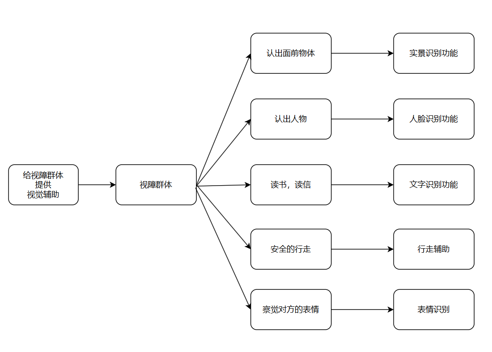

## 功能畅想

① 实景识别（ yolo+大模型 ，可提问交互）

② 人脸识别（yolo+arcface+大模型）

​	 文字识别 

④ 行走辅助（yolo   以及更多cv算法，实时的）

​	 表情识别

​     颜色识别（大模型可做？）

​	志愿者人工

##### others

③ 语音交互

⑥ （上下文无关）多段对话or 清空历史对话？

## 影响地图

## 用户旅程

用户：视障群体 

目标：愉快的一天

| 旅程 | 穿搭           | 关门               | 去坐公交                   | 交接工作             | 聊天         |
| ---- | -------------- | ------------------ | -------------------------- | -------------------- | ------------ |
| 行动 | 寻找一个帽子   | 摸到门口有张纸     | 走到公交站                 | 找到协作的同事       | 我讲了个笑话 |
| 想法 | 忘记了，在哪？ | 写的什么？         | 路上会不会有危险           | 他在哪，这个人是他吗 | 他笑了吗     |
| 感受 | 又要找好久     | 广告还是通知单     | 害怕危险                   | 万一找错人了，好尴尬 | 忐忑不安     |
| 机会 | 实景识别辅助   | 文字识别，语音读出 | 实时行走辅助，识别危险信息 | 人脸识别辅助         | 表情识别     |

## 简单故事

1.  我想买到雪碧，

    我拿起了一瓶饮料，但不知道是否是雪碧

    使用实景识别功能

2.  我想看信

    我看不见

    使用文字识别功能

## 用户故事 User Story

作为一个盲人，我想快速知道我面前是什么东西，以便做出下一步行为

满意条件：实现实景识别功能 

作为一个盲人，我需要阅读一些文字信息，以便

满意条件：实现OCR功能

作为一个盲人， 我想要辨别面前的人，

满意条件：人脸识别功能

## 细分子功能，规划任务

| 子功能                                     | 技术                                                  | 任务量 | 排序 |
| ------------------------------------------ | ----------------------------------------------------- | ------ | ---- |
| 实景识别）                                 | 部署计算服务器上的大语言模型（图+文->文               | 20     | 1    |
| 搭建小程序框架，对接后端，接口设计，ui设计 | （需要学习）小程序界面设计，设计接口                  | 80     | 1    |
| 搭建服务器                                 | 是否需要再次转接校园网计算服务器？                    | 5      | 1    |
| yolo辅助实景识别                           | 部署计算服务器上的yolo模型，作为语言输入              | 13     | 2    |
| 小程序语音交互                             | 调用语音识别API或者本地识别                           | 13     | 2    |
| 文字识别                                   | OCR传统算法 + 大语言模型                              | 20     | 3    |
| 小程序语音教程                             | 录制音频                                              | 1      | 3    |
| 人脸识别                                   | 部署计算服务器上的人脸识别模型+用户数据集存储（后端） | 40     | 3    |
| 整体测试                                   |                                                       | 8      | 4    |
|                                            |                                                       |        |      |
| 表情识别                                   |                                                       | ？     |      |
| 行走辅助                                   | 暂定为连续的实景识别，进阶可以使用其他cv算法          | ？     |      |
|                                            |                                                       |        |      |
|                                            |                                                       |        |      |
|                                            |                                                       |        |      |
|                                            |                                                       |        |      |
|                                            |                                                       |        |      |

## 第一次Sprint Planning

 第一次迭代任务：

| 子功能                                     | 技术                                    | 任务量 | 排序 |
| ------------------------------------------ | --------------------------------------- | ------ | ---- |
| 实景识别）                                 | 部署计算服务器上的大语言模型（图+文->文 | 20     | 1    |
| 搭建小程序框架，对接后端，接口设计，ui设计 | （需要学习）小程序界面设计，设计接口    | 80     | 1    |
| 搭建服务器                                 | 是否需要再次转接校园网计算服务器？      | 5      | 1    |

daily scrum：时间：  课间

